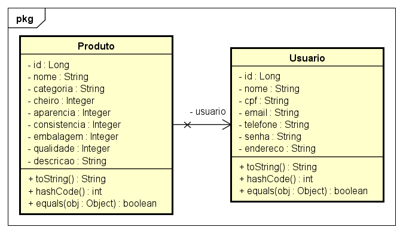

# my-donations

Aplicativo feito para a Global Solution do primeiro semestre do segundo ano de Análise e Desenvolvimento de Sistemas na FIAP.

# Video 
https://youtu.be/RC7y4uJ2fLU

# Diagrama de Classes


# Tecnologias
- Springboot
- MySQL
- Oracle 


# Instruções de Instalação dessa aplicação
1. Clone este repositório
2. Abra o projeto no Eclipse
3. Altere o usuário no ``persistece.xml`` para o usuário do seu banco de dados
4. Execute os métodos na pasta ``app``


# Instruções de Instalação da API Springboot

1. Clone o repositório ``
2. Abra o projeto na IDE de sua preferência
3. Execute o projeto
4. Acesse o endereço http://localhost:8080/swagger-ui.html
5. Teste os endpoints
6. Caso deseje usar o banco de dados Oracle, altere o arquivo application.properties para o seguinte:

```properties
spring.jpa.hibernate.ddl-auto=update

spring.datasource.url=jdbc:oracle:thin:@oracle.fiap.com.br:1521:orcl
spring.datasource.username=USUARIO
spring.datasource.password=SENHA

spring.jpa.show-sql: true

server.error.include-stacktrace=never

jwt.secret=S3cr3T_0
jwt.issuer=fiap-gs
```

7. Para testar as endpoints, use o Postman, Insomnia ou qualquer outro software de sua preferência, com a URL http://localhost:8080/api/v1/ e os endpoints abaixo:

## Endpoints da API

- [my-donations](#my-donations)
- [Video](#video)
- [Diagrama de Classes](#diagrama-de-classes)
- [Tecnologias](#tecnologias)
- [Instruções de Instalação dessa aplicação](#instruções-de-instalação-dessa-aplicação)
- [Instruções de Instalação da API Springboot](#instruções-de-instalação-da-api-springboot)
  - [Endpoints da API](#endpoints-da-api)
    - [Login](#login)
    - [Cadastro de Usuario](#cadastro-de-usuario)
    - [Visualizar Usuario](#visualizar-usuario)
    - [Visualizar Usuario por Id](#visualizar-usuario-por-id)
    - [Editar Usuario](#editar-usuario)
    - [Excluir Usuario](#excluir-usuario)
    - [Cadastro de Produtos](#cadastro-de-produtos)
    - [Listar Produtos](#listar-produtos)
    - [Visualizar Produto por Id](#visualizar-produto-por-id)
    - [Editar Produtos](#editar-produtos)
    - [Excluir Produto](#excluir-produto)

### Login

`POST` my-donations/api/v1/usuario/login

**Exemplo de Entrada**

```js
{
  "email": "email@email.com",
  "senha": "123456"
}
```

**Campos de Requisição**
| Campo | Obrigatório | Tipo | Descrição |
|-------|:-------------:|-------|-----------|
| email | sim | string | O email do usuario que foi cadastrado no banco de dados
| senha | sim | string | A senha do usuario que foi cadastrado no banco de dados

**Códigos da Resposta**
|código|descrição
|-|-
200 | o login foi realizado com sucesso
400 | os dados enviados são inválidos

### Cadastro de Usuario

`POST` my-donations/api/v1/usuario/registrar

**Exemplo de Entrada**

```js
{
	"nome": "Nome",
  "cpf": "000.000.000-00",
  "email": "email@email.com",
  "telefone": "(11) 99123-4567",
  "nascimento": "2000-05-31",
  "senha": "123456",
  "endereco": "São Paulo"
}
}
```

**Campos de Requisição**
| Campo | Obrigatório | Tipo | Descrição |
|-------|:-------------:|-------|-----------|
| nome | sim | string | O nome completo do usuário
| cpf | sim | string | O cpf do usuário
| email | sim | string | O email do usuário
| telefone | sim | string | O telefone do usuário
| nascimento | sim | string | A data de nascimento do usuário
| senha | sim | string | A senha do usuário
| endereco | sim | string | O endereço do usuário

**Códigos da Resposta**
|código|descrição
|-|-
200 | o usuário foi cadastrada com sucesso
400 | os dados enviados são inválidos

### Visualizar Usuario

`GET` my-donations/api/v1/usuario

**Exemplo de Saida**

```js
{
	"id": 1,
	"nome": "nome",
	"cpf": "000.000.000-00",
	"email": "email@email.com",
	"telefone": "(11) 99123-4567",
	"nascimento": "2000-05-31",
	"senha": "$2a$10$qQ9Jpddv6rClolfJzSlsqeUbsHOwRQKF8OGYQRS3e7IWimbnPAY/S",
	"endereco": "São Paulo"
}
```

**Códigos da Resposta**
|código|descrição
|-|-
| 200 | os dados do usuário logado foram retornados
| 404 | não existe usuário com o ID informado

### Visualizar Usuario por Id

`GET` my-donations/api/v1/usuario/{id}

**Exemplo de Saida**

```js
{
	"id": 2,
	"nome": "nome2",
	"cpf": "000.000.000-01",
	"email": "email2@email.com",
	"telefone": "(11) 99123-9876",
	"nascimento": "2001-09-19",
	"senha": "$2a$10$qQ9Jpddv6rClolfJzSlsqeUbsHOwRQKF8OGYQRS3e7IWimbnPAY/S",
	"endereco": "São Paulo"
}
```

**Códigos da Resposta**
|código|descrição
|-|-
| 200 | os dados do usuário com o id informado foram retornados
| 404 | não existe usuário com o id informado

### Editar Usuario

`PUT` my-donations/api/v1/usuario

**Exemplo de Entrada**

```js
{
	"id": 1,
	"nome": "nome",
	"cpf": "000.000.000-00",
	"email": "email@email.com",
	"telefone": "(11) 99123-4567",
	"nascimento": "2000-05-31",
	"senha": "$2a$10$qQ9Jpddv6rClolfJzSlsqeUbsHOwRQKF8OGYQRS3e7IWimbnPAY/S",
	"endereco": "São Paulo"
}
```

**Campos de Requisição**
| Campo | Obrigatório | Tipo | Descrição |
|-------|:-------------:|-------|-----------|
| nome | sim | string | O nome completo do usuário
| cpf | sim | string | O cpf do usuário
| email | sim | string | O email do usuário
| telefone | sim | string | O telefone do usuário
| nascimento | sim | string | A data de nascimento do usuário
| senha | sim | string | A senha do usuário
| endereco | sim | string | O endereço do u

**Códigos da Resposta**
|código|descrição
|-|-
| 200 | os dados do usuário foram atualizados
| 404 | não existe usuário com o ID informado

### Excluir Usuario

`DELETE` my-donations/api/v1/usuario

**Códigos da Resposta**
|código|descrição
|-|-
| 200 | os dados do usuário foram excluídos
| 202 | os dados do usuário foram encontrados mas não ainda excluídos
| 204 | houve a ação de excluir mas os dados do usuário não foram encontrados

### Cadastro de Produtos

`POST` my-donations/api/v1/produto

**Exemplo de Entrada**

```js
{
	"usuario": {
		"id": 1,
	},
	"nome": "Arroz",
	"categoria": "Cereais",
	"validade": "2023-12-15",
	"cheiro": 5,
	"aparencia": 4,
	"consistencia": 3,
	"embalagem": 4,
	"qualidade": 5,
	"descricao": "Pacote de arroz novo e fechado",
}
```

**Campos de Requisição**
| Campo | Obrigatório | Tipo | Descrição |
|-------|:-------------:|-------|-----------|
| usuario | sim | object | O objeto contendo o id do usuáiro
| id | sim | int | O id do usuáiro dentro do objeco
| nome | sim | string | O nome do produto
| categoria | sim | string | A categoria do produto
| validade | sim | string | A data de validade do produto
| cheiro | sim | int | O valor da definição das possibilidades do cheiro
| aparencia | sim | int | O valor da definição das possibilidades da aparência
| consistencia | sim | int | O valor da definição das possibilidades da consistência
| embalagem | sim | int | O valor da definição das possibilidades da embalagem
| qualidade | sim | int | O valor da definição das possibilidades da qualidade
| descricao | não | string | A descrição do produto

**Códigos da Resposta**
|código|descrição
|-|-
201 | o produto foi cadastrado com sucesso
400 | os dados enviados são inválidos

### Listar Produtos

`GET` my-donations/api/v1/produto

**Exemplo de Saida**

**Exemplo de Saida**

```js
[
  {
    "usuario": {
      "id": 1,
      "nome": 'nome',
      "cpf": '000.000.000-00',
      "email": 'email@email.com',
      "telefone": '(11) 99123-4567',
      "nascimento": '2000-05-31',
      "senha": '$2a$10$qQ9Jpddv6rClolfJzSlsqeUbsHOwRQKF8OGYQRS3e7IWimbnPAY/S',
      "endereco": 'São Paulo'
    },
    "nome": 'Arroz',
    "categoria": 'Cereais',
    "validade": '2023-12-15',
    "cheiro": 5,
    "aparencia": 4,
    "consistencia": 3,
    "embalagem": 4,
    "qualidade": 5,
    "descricao": 'Pacote de arroz novo e fechado'
  },
  {
    "usuario": {
      "id": 1,
      "nome": 'nome',
      "cpf": '000.000.000-00',
      "email": 'email@email.com',
      "telefone": '(11) 99123-4567',
      "nascimento": '2000-05-31',
      "senha": '$2a$10$qQ9Jpddv6rClolfJzSlsqeUbsHOwRQKF8OGYQRS3e7IWimbnPAY/S',
      "endereco": 'São Paulo'
    },
    "nome": 'Feijão',
    "categoria": 'Cereais',
    "validade": '2024-01-25',
    "cheiro": 4,
    "aparencia": 3,
    "consistencia": 5,
    "embalagem": 5,
    "qualidade": 4,
    "descricao": 'Pacote de feijão novo e fechado'
  }
]
```

**Códigos da Resposta**
|código|descrição
|-|-
200 | os dados dos produtos foram retornados
404 | não existe produto com o id informado

### Visualizar Produto por Id

`GET` my-donations/api/v1/produto/{id}

**Exemplo de Saida**

```js
{
  "usuario": {
    "id": 1,
    "nome": 'nome',
    "cpf": '000.000.000-00',
    "email": 'email@email.com',
    "telefone": '(11) 99123-4567',
    "nascimento": '2000-05-31',
    "senha": '$2a$10$qQ9Jpddv6rClolfJzSlsqeUbsHOwRQKF8OGYQRS3e7IWimbnPAY/S',
    "endereco": 'São Paulo'
  },
  "nome": 'Arroz',
  "categoria": 'Cereais',
  "validade": '2023-12-15',
  "cheiro": 5,
  "aparencia": 4,
  "consistencia": 3,
  "embalagem": 4,
  "qualidade": 5,
  "descricao": 'Pacote de arroz novo e fechado'
}
```

**Códigos da Resposta**
|código|descrição
|-|-
| 200 | os dados do produto com o id informado foram retornados
| 404 | não existe produto com o id informado

### Editar Produtos

`PUT` my-donations/api/v1/produto/{id}

**Exemplo de Entrada**

```js
{
  "usuario": {
    "id": 1,
  },
  "nome": 'Arroz',
  "categoria": 'Cereais',
  "validade": '2023-12-15',
  "cheiro": 5,
  "aparencia": 4,
  "consistencia": 3,
  "embalagem": 4,
  "qualidade": 5,
  "descricao": 'Pacote de arroz novo e fechado'
}
```

**Campos de Requisição**
| Campo | Obrigatório | Tipo | Descrição |
|-------|:-------------:|-------|-----------|
| usuario | sim | object | O objeto contendo o id do usuáiro
| id | sim | int | O id do usuáiro dentro do objeco
| nome | sim | string | O nome do produto
| categoria | sim | string | A categoria do produto
| validade | sim | string | A data de validade do produto
| cheiro | sim | int | O valor da definição das possibilidades do cheiro
| aparencia | sim | int | O valor da definição das possibilidades da aparência
| consistencia | sim | int | O valor da definição das possibilidades da consistência
| embalagem | sim | int | O valor da definição das possibilidades da embalagem
| qualidade | sim | int | O valor da definição das possibilidades da qualidade
| descricao | não | string | A descrição do produto

**Códigos da Resposta**
|código|descrição
|-|-
| 200 | os dados do produto foram atualizados
| 404 | não existe produto com o ID informado

### Excluir Produto

`DELETE` my-donations/api/v1/produto/{id}

**Códigos da Resposta**
|código|descrição
|-|-
| 200 | os dados do produto foram excluídos
| 202 | os dados do produto foram encontrados mas não ainda excluídos
| 204 | houve a ação de excluir mas os dados do produto não foram encontrados